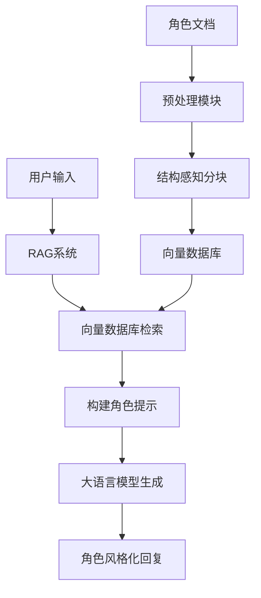

# 天照角色扮演RAG系统 - REMADE

## 概述
本系统是一个基于本地RAG（检索增强生成）的角色扮演对话系统，专门为《阴阳师》游戏中的角色"天照"设计。系统整合了角色知识库、语义检索和生成式AI，实现了符合角色设定的智能对话体验。

## 系统架构


## 技术栈
### 核心框架
- **LangChain** - 用于构建整个RAG管道，包括：
  - 文档加载与解析
  - 结构感知的文本分块
  - 向量数据库集成(FAISS)
  - 文档表示标准化
- **Hugging Face Transformers** - 提供LLM和嵌入模型
- **FAISS** - Facebook高效的相似度搜索库

### 数据处理
- **PyPDF2** - PDF文档解析
- **python-docx** - DOCX文档处理
- **正则表达式(re)** - 文本结构化处理
- **RecursiveCharacterTextSplitter** - 智能文本分块

### 模型与嵌入
- **Qwen1.5-0.6B** - 本地部署的轻量级大语言模型
- **all-MiniLM-L6-v2** - Sentence Transformers轻量级嵌入模型

### 辅助工具
- **PyTorch** - 深度学习框架
- **JSON** - 元数据存储
- **OS** - 文件系统操作

## 核心功能模块

### 1. 数据预处理 (`file_processor.py`)
- **功能**：将不同格式的角色文档统一转换为结构化文本
- **处理流程**：
  1. 识别文档格式（PDF/DOCX/TXT）
  2. 提取原始文本内容
  3. 为文档结构添加标签：
     - `[SECTION_1]`：一级标题（如"一、核心身份信息"）
     - `[SECTION_2]`：二级标题（如"1.角色名称："）
- **输出**：`./parsed_document/` 目录下的预处理文本

### 2. 结构感知分块 (`text_chunker.py`)
- **功能**：根据文档结构智能分割文本
- **核心算法**：
  - 识别标题标签，维护当前上下文
  - 短内容直接成块，长内容使用递归分割
  - 每个块添加父级标题前缀（如"二、性格-1.至高无上的威严与神性"）
- **输出**：`./chunk_output/` 目录下的分块文本及元数据

### 3. 向量数据库 (`vector_db.py`)
- **功能**：构建角色知识语义检索系统
- **核心技术**：
  - Sentence-BERT中文嵌入模型
  - FAISS高效相似度搜索
  - 增量更新机制
- **特性**：
  - 自动检测新增内容
  - 支持语义相似度检索
  - 保存检索历史记录

### 4. RAG对话系统 (`main.py`)
- **功能**：角色扮演对话引擎
- **工作流程**：
  1. 接收用户查询
  2. 从向量库检索相关知识片段
  3. 构建整合角色设定的提示模板
  4. 生成符合角色设定的回复
- **角色设定整合**：
  - 核心人格特质
  - 语言风格要求
  - 当前情感状态
  - 对话对象语气差异

## 系统特点

### 角色一致性保障
1. **人格特质嵌入**：
   - 威严神性与母性悲悯的平衡
   - 光明与黑暗的内心冲突
   - 对月读的特殊情感处理

2. **语言风格控制**：
   ```python
   # 提示词片段示例
   "语言保持庄重典雅，使用太阳意象和神谕式表达"
   "对众生：威严疏离但庇护"
   "对月读：充满痛苦、恳求与决绝的爱"
   ```

3. **情感状态模拟**：
   - 根据查询内容动态调整情感表达
   - 展现神性威严下的疲惫与挣扎
   - 处理虚无侵蚀时的冰冷特质

## 快速开始指南

### 安装依赖
```bash
pip install -r requirements.txt
```

### 数据处理流程
```bash
# 1. 文档预处理
python file_processor.py

# 2. 结构分块
python text_chunker.py

# 3. 构建向量库
python vector_db.py
```

### 启动对话系统
```bash
python main.py
```

### 交互示例
```
用户: 你为何要接纳虚无之力？
天照: 吾宣告：此乃太阳之宿命！为从虚无深渊夺回吾弟月读之神识，纵使神格蒙尘，辉光染晦...
```

## 项目结构
```
.
├── my_knowledge_base/          # 知识库核心模块
│   ├── file_processor.py       # 文档预处理脚本
│   ├── text_chunker.py         # 文本分块处理脚本
│   ├── vector_db.py            # 向量数据库核心脚本
│   ├── inspect_vector_db.py    # 向量数据库检查工具
│   │
│   ├── Amaterasu/              # 原始角色文档
│   ├── parsed_document/        # 预处理结果
│   ├── chunk_output/           # 分块结果
│   │
│   └── vector_db/              # 向量数据库
│       ├── faiss.index         # 向量索引
│       └── metadata.json       # 元数据
│
├── embedding_model/            # 嵌入模型存储
├── Qwen3-0.6B/                 # 大语言模型
│
├── main.py                     # 主程序入口
├── requirements.txt            # Python依赖
└── README.md                   # 项目说明
```

## 技术亮点
1. **结构化感知分块**：保留文档层级结构的分块技术
2. **角色人格嵌入**：深度整合角色设定到提示工程
3. **轻量本地化**：所有组件可在消费级GPU运行
4. **增量知识更新**：支持向量数据库动态扩展
```